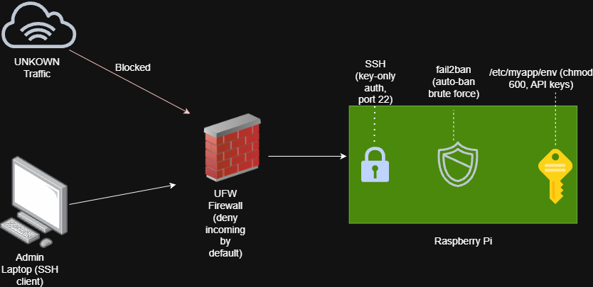

# iam-security-lab
# AI robotic hardening

## Overview
I built the Picar-x from a raspberry pi 4 for fun mainly, I wanted to add a ai to it to it and essentially create my own robot that was smart. However because you never know this day in age, for the defensive side of Security I decided to really try to reduce the surface attack vectors. I wanted to see what I could do to help ensure the Pi was safe along with the AI. 

## Architecture


The Pi runs headless with locked down remote access; API credentials are isolated from the application codebase, and unused network services/ports are disabled to reduce the attack surface.

## Technologies Used
- Raspberry Pi 4 Model B
- Google Gemini AP
- ufw / firewall rules
- SSH hardening (key-only auth)

## What This Project Demonstrates
- Isolating API credentials from application code on an edge device
- SSH hardening (key-only authentication) to eliminate password-based attack vectors
- Reducing overall attack surface by disabling unused services

## How to Deploy / Reproduce

### 1. Install and configure the firewall (ufw)
```bash
# Install ufw
sudo apt install ufw -y

# Set default policies: block all incoming, allow all outgoing
sudo ufw default deny incoming
sudo ufw default allow outgoing

# Allow SSH before enabling — do this first or you'll lock yourself out
sudo ufw allow ssh

# Enable the firewall and confirm the rules
sudo ufw enable
sudo ufw status verbose
```

### 2. Generate an SSH key pair (on your local machine — PowerShell on Windows, Terminal on Mac/Linux — (not the Pi)
```bash
ssh-keygen -t ed25519 -C "your-label-here"
``` 

### 3. Copy the public key to the Pi

​```bash
ssh-copy-id sachse02@<pi-ip-address>
​```

**Note for Windows users:** `ssh-copy-id` is a Linux/Mac only tool and
isn't available in PowerShell — you'll get `'ssh-copy-id' is not
recognized as an internal or external command`. Use this instead:

​```bash
type C:\Users\<you>\.ssh\id_ed25519.pub | ssh sachse02@<pi-ip-address> "mkdir -p ~/.ssh && cat >> ~/.ssh/authorized_keys"
​```

Both prompt for the Pi's account password one last time that's
expected, since you need an existing way in to install the very first key.
```

### 4. Test key based login before disabling passwords
```bash
ssh pi@<pi-ip-address>
```
Confirm you can log in with no password prompt before continuing.

### 5. Disable password authentication on the Pi
Edit the SSH config:
```bash
sudo nano /etc/ssh/sshd_config
```
Set the following values:
```
PasswordAuthentication no
PubkeyAuthentication yes
```

### 6. Restart SSH to apply changes
```bash
sudo systemctl restart ssh
```

### 7. (Optional) Additional hardening
```bash
# Auto-ban IPs after repeated failed login attempts
sudo apt install fail2ban -y
```
### 8. Lock down file permissions on project code

By default, files and folders may be loose with permissions. So always make sure to restrict and review anything you create or share. 


​```bash
# Directories: owner gets full access, group can read/enter but not write,
# everyone else gets nothing
chmod -R 750 ~/path/to/your/project/

# Files: owner can read/write, group can read-only, everyone else gets nothing
find ~/path/to/your/project/ -type f -exec chmod 640 {} \;
​```

Verify the result:

​```bash
ls -la ~/path/to/your/project/
​```
​

Expected output:
​```
APT::Periodic::Update-Package-Lists "1";
APT::Periodic::Unattended-Upgrade "1";
​```
### 10. Keep secrets out of application code

Hardcoding API keys directly in scripts is a common way credentials
end up leaked — especially if that code is ever pushed to a public
repo. Store secrets in a separate, permission-locked file instead.

​```bash
sudo mkdir -p /etc/myapp
sudo nano /etc/myapp/env
​```

Add secrets in `KEY=value` format, one per line:
​```
API_KEY=your_actual_key_here
​```

Lock the file down so only root can read it:
​```bash
sudo chmod 600 /etc/myapp/env
sudo chown root:root /etc/myapp/env
​```

If the app runs as a systemd service, load the file via
`EnvironmentFile=` in the unit file:
​```
[Service] 
EnvironmentFile=/etc/myapp/env
​```

The application code itself never contains a single secret — it's
safe to make the repo public.

​```bash
# Directories: owner gets full access, group can read/enter but not write,
# everyone else gets nothing
chmod -R 750 ~/path/to/your/project/

# Files: owner can read/write, group can read-only, everyone else gets nothing
find ~/path/to/your/project/ -type f -exec chmod 640 {} \;
​```

Verify the result:

​```bash
ls -la ~/path/to/your/project/
​```

**Note:** if any files in the directory were created by a different user
(e.g. `root`, from running a script with `sudo`), `chmod` will fail with a
permissions error on those specific files — you'll need to either remove
them (if they're just regenerated cache files, like Python's `__pycache__`)
or use `sudo chmod` on that specific file instead.
```

## Key Findings / Results
Before/after state — e.g. "X ports open by default → down to Y after lockdown" or a table/screenshot of ufw status before and after. This section is what makes the project credible — worth filling in with real output.

## What I Learned
[See Part 5 for how to write this section well.]

## What I'd Improve
[Be specific. This section is read closely by hiring managers.]
